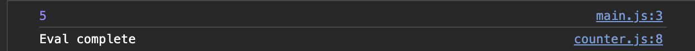
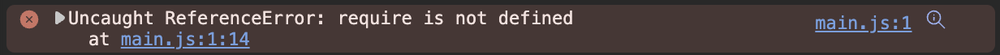

# Implementación HTML y Javascript con modulos

Referencias:

| URL                                                                                                                                                                    | Descripción                                                                                                           |
| ---------------------------------------------------------------------------------------------------------------------------------------------------------------------- | ---------------------------------------------------------------------------------------------------------------------- |
| [Módulos JavaScript - JavaScript - MDN (mozilla.org)](https://developer.mozilla.org/es/docs/Web/JavaScript/Guide/Modules)                                                | Explicación del uso de modulos en HTML, requiere servidor de arranque                                                 |
| [ES6 In Depth: Modules - Mozilla Hacks - the Web developer blog](https://hacks.mozilla.org/2015/08/es6-in-depth-modules/)                                                 | Explicación del modulos en JS                                                                                         |
| [ES modules: A cartoon deep-dive - Mozilla Hacks - the Web developer blog](https://hacks.mozilla.org/2018/03/es-modules-a-cartoon-deep-dive/)                             | Explicación en profundo como funciona el export e import module                                                       |
| [JavaScript modules · V8](https://v8.dev/features/modules#mjs)                                                                                                           | Documentacieon oficial Modules V8 Navegador                                                                            |
| [Funciones - JavaScript - MDN (mozilla.org)](https://developer.mozilla.org/es/docs/Web/JavaScript/Guide/Functions)                                                        |                                                                                                                        |
| [Functions - JavaScript - MDN (mozilla.org)](https://developer.mozilla.org/docs/Web/JavaScript/Reference/Functions/Arrow_functions)                                       | Doc de arrow functions                                                                                                 |
| [Global_Objects - JavaScript - MDN (mozilla.org)](https://developer.mozilla.org/docs/Web/JavaScript/Reference/Global_Objects/Object)                                      | Objetos                                                                                                                |
| [Global_Objects - JavaScript - MDN (mozilla.org)](https://developer.mozilla.org/docs/Web/JavaScript/Reference/Global_Objects/Array)                                       | Array y array methods                                                                                                  |
| [Operators - JavaScript - MDN (mozilla.org)](https://developer.mozilla.org/docs/Web/JavaScript/Reference/Operators/Destructuring_assignment)                              | destructuring                                                                                                          |
| [Template_literals - JavaScript - MDN (mozilla.org)](https://developer.mozilla.org/docs/Web/JavaScript/Reference/Template_literals)                                       | literales                                                                                                              |
| [Operators - JavaScript - MDN (mozilla.org)](https://developer.mozilla.org/docs/Web/JavaScript/Reference/Operators/Conditional_Operator)                                  | operador ternario                                                                                                      |
| [Rendering: Server Components - Next.js (nextjs.org)](https://nextjs.org/docs/app/building-your-application/rendering/server-components)                                  | Comportamiento del servidor para renderizado de componentes                                                            |
| [Routing: Loading UI and Streaming - Next.js (nextjs.org)](https://nextjs.org/docs/app/building-your-application/routing/loading-ui-and-streaming#instant-loading-states) | Carga de interfaces y streaming SSR                                                                                    |
| [Rendering: Client - Next.js (nextjs.org)](https://nextjs.org/docs/app/building-your-application/rendering/client-components)                                             | Renderizado en cliente y limitaciones                                                                                  |
| [Rendering: Composition - Next.js (nextjs.org)](https://nextjs.org/docs/app/building-your-application/rendering/composition-patterns)                                     | 🚨 Importante: Conocer patrones de composición de renderizado                                                         |
| [Routing: Pages and Layouts - Next.js (nextjs.org)](https://nextjs.org/docs/app/building-your-application/routing/pages-and-layouts)                                      | Pages, Layout y Template                                                                                               |
| [Directives – React](https://react.dev/reference/react/directives)                                                                                                       | React directivas para `use cliente` y `user server`                                                                |
| [Building Your Application: Caching - Next.js (nextjs.org)](https://nextjs.org/docs/app/building-your-application/caching#request-memoization)                            | Cache en nextjs, por defecto almancena las solicitudes GET en cache                                                    |
| [Building Your Application: Routing - Next.js (nextjs.org)](https://nextjs.org/docs/app/building-your-application/routing)                                                | Fundamientos de Routing: archivos por defecto, paralelismo de rutas                                                    |
| [Prisma - Next-generation ORM for Node.js &amp; TypeScript](https://www.prisma.io/)                                                                                       | ORM para backend                                                                                                       |
| [next.config.js Options: Partial Prerendering  Next.js (nextjs.org)](https://nextjs.org/docs/app/api-reference/next-config-js/partial-prerendering)                       | Renderizado dinamico para componentes en React                                                                         |
| [How to Think About Security in Next.js  Next.js (nextjs.org)](https://nextjs.org/blog/security-nextjs-server-components-actions)                                         | Seguridad en nextjs                                                                                                    |
| [Routing: Error Handling - Next.js (nextjs.org)](https://nextjs.org/docs/app/building-your-application/routing/error-handling)                                            | Error handling                                                                                                         |
| [Learn Accessibility - web.dev](https://web.dev/learn/accessibility/)                                                                                                     | Accesobilidad WEB, incluye aspectos de discapacidad                                                                    |
| [Credentials authentication - Auth.js (authjs.dev)](https://authjs.dev/getting-started/providers/credentials-tutorial?frameworks=next)                                    | Mayor información para autenticarse con cualquier otro proveedor de authenticación, esto incluye desarrollos propios |
| [Learn Next.js: Next Steps - Next.js (nextjs.org)](https://nextjs.org/learn/dashboard-app/next-steps)                                                                     | Siguientes pasos, template, doc, etc                                                                                   |

### Ejemplo de ES vs JS

**Con Modulo**

```javascript
// counter.js

import { message } from './main.js';
export const count = 5
setTimeout(() => { console.log(message) });

// main.js

import { count } from './counter.js'
console.log(count)
export const message = 'Eval complete'
```



**Sin modulo**

```javascript
// counter.js

let message = require('./main').message
exports.count = 5
setTimeout(() => { console.log(message) });

// main.js

let count  = require('./counter').count
console.log(count)
exports.message = 'Eval complete'
```



## NextJS Tips

> **Good to know** : The App Router takes priority over the Pages Router. Routes across directories should not resolve to the same URL path and will cause a build-time error to prevent a conflict.

> **Dynamic Routes with Cached Data**
>
> In most websites, routes are not fully static or fully dynamic - it's a spectrum. For example, you can have an e-commerce page that uses cached product data that's revalidated at an interval, but also has uncached, personalized customer data.
>
> In Next.js, you can have dynamically rendered routes that have both cached and uncached data. This is because the RSC Payload and data are cached separately. This allows you to opt into dynamic rendering without worrying about the performance impact of fetching all the data at request time.
>
> Learn more about the [full-route cache](https://nextjs.org/docs/app/building-your-application/caching#full-route-cache) and [Data Cache](https://nextjs.org/docs/app/building-your-application/caching#data-cache).

> **Defining multiple `use client` entry points** :
>
> You can define multiple "use client" entry points in your React Component tree. This allows you to split your application into multiple client bundles (or branches).
>
> However, `"use client"` doesn't need to be defined in every component that needs to be rendered on the client. Once you define the boundary, all child components and modules imported into it are considered part of the client bundle.

### Client Side Rendering


### Server Side Rendering


### Patrones de composición

## [When to use Server and Client Components?](https://nextjs.org/docs/app/building-your-application/rendering/composition-patterns#when-to-use-server-and-client-components)

Here's a quick summary of the different use cases for Server and Client Components:

| What do you need to do?                                                                  | Server Component | Client Component |
| ---------------------------------------------------------------------------------------- | ---------------- | ---------------- |
| Fetch data                                                                               | ✅               | ❌               |
| Access backend resources (directly)                                                      | ✅               | ❌               |
| Keep sensitive information on the server (access tokens, API keys, etc)                  | ✅               | ❌               |
| Keep large dependencies on the server / Reduce client-side JavaScript                    | ✅               | ❌               |
| Add interactivity and event listeners (`onClick()`, `onChange()`, etc)               | ❌               | ✅               |
| Use State and Lifecycle Effects (`useState()`, `useReducer()`, `useEffect()`, etc) | ❌               | ✅               |
| Use browser-only APIs                                                                    | ❌               | ✅               |
| Use custom hooks that depend on state, effects, or browser-only APIs                     | ❌               | ✅               |
| Use[React Class components](https://react.dev/reference/react/Component)                    | ❌               | ✅               |

---

# Next steps

[Learn Next.js | Next.js (nextjs.org)](https://nextjs.org/learn/dashboard-app)


## Step1

crear proyecto:

`npx create-next-app@latest nextjs-dashboard --use-npm --example "https://github.com/vercel/next-learn/tree/main/dashboard/starter-example"`

### [Recommended reading](https://nextjs.org/learn/dashboard-app/optimizing-fonts-images#recommended-reading)

There's a lot more to learn about these topics, including optimizing remote images and using local font files. If you'd like to dive deeper into fonts and images, see:

* [Image Optimization Docs](https://nextjs.org/docs/app/building-your-application/optimizing/images)
* [Font Optimization Docs](https://nextjs.org/docs/app/building-your-application/optimizing/fonts)
* [Improving Web Performance with Images (MDN)](https://developer.mozilla.org/en-US/docs/Learn/Performance/Multimedia)
* [Web Fonts (MDN)](https://developer.mozilla.org/en-US/docs/Learn/CSS/Styling_text/Web_fonts)

### Up postgresql

```bash
# Initialize database postgresql

docker run --name nextjs-dashboard-postgres -p 5432:5432 -e POSTGRES_USER=postgres -e POSTGRES_PASSWORD=12345678 -e POSTGRES_DB=postgresDB -d postgres
   
```

### Experimental: Partial Prerendering

- Implementación en desarrollo para opder hacer carga dinamica de webs, la implementación se hace con una pagina estatica, dejando los espacios dinamicos que se carguen de forma asincronza.


### Authentication

```bash
# Install next-auth beta

$ npm install next-auth@beta

# Crear hash para cibrar cookies

$ openssl rand -base64 32

7YKBvYOeDF63tQlaEjPL6j5EsnugeCZy2qeojvydnZE=

# Configure llave en el archivo .env
# AUTH_SECRET=7YKBvYOeDF63tQlaEjPL6j5EsnugeCZy2qeojvydnZE=

```

### User/Password authentication for dev

> Email: `user@nextmail.com`
>
> Password: `123456`

### [Types of metadata](https://nextjs.org/learn/dashboard-app/adding-metadata#types-of-metadata)

There are various types of metadata, each serving a unique purpose. Some common types include:

 **Title Metadata** : Responsible for the title of a webpage that is displayed on the browser tab. It's crucial for SEO as it helps search engines understand what the webpage is about.

```html
<title>Page Title</title>
```

 **Description Metadata** : This metadata provides a brief overview of the webpage content and is often displayed in search engine results.

```html
<metaname="description"content="A brief description of the page content." />
```

 **Keyword Metadata** : This metadata includes the keywords related to the webpage content, helping search engines index the page.

```html
<metaname="keywords"content="keyword1, keyword2, keyword3" />
```

 **Open Graph Metadata** : This metadata enhances the way a webpage is represented when shared on social media platforms, providing information such as the title, description, and preview image.

```html
<metaproperty="og:title"content="Title Here" /><metaproperty="og:description"content="Description Here" /><metaproperty="og:image"content="image_url_here" />
```

 **Favicon Metadata** : This metadata links the favicon (a small icon) to the webpage, displayed in the browser's address bar or tab.

```html
<linkrel="icon"href="path/to/favicon.ico" />
```

## Doc referencial para implementaciones futuras:

### Frontend

- [What&#39;s a story? • Storybook docs](https://storybook.js.org/docs/get-started/whats-a-story)
- [Components Overview - Ant Design](https://ant.design/components/overview)
- [Visual testing &amp; review for web user interfaces • Chromatic](https://www.chromatic.com/)
- [Installation – three.js docs (threejs.org)](https://threejs.org/docs/index.html#manual/en/introduction/Installation)

### Backend

- [Project IDX](https://idx.dev/)
- [Introduction | Pact Docs](https://docs.pact.io/)
- [Supabase | The Open Source Firebase Alternative](https://supabase.com/)
- [Getting Started - Hono](https://hono.dev/getting-started/basic)
